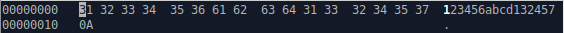

## DES file encryptor

Programs are designed to encrypt/decrypt files using the DES algorithm.

Implemented 2 encryption modes: ECB and CTR

### An exapmle of program working

Original file data:

Launching the program:

The 1st argument: key (1010101110111010000010000001100100100110001101111100110111011100);

The 2nd argument: name of encrypted file (example.txt);

The 3rd argument: mode of program working (1 - encryption; 2 - decryption).

Cipher data:

Highlighted in blue: 32 bytes of Initialisation Vector (IV);

Highlighted in yellow: number of appended zero bytes (block padding up to 64 bits);

Highlighted in red: cipher data.

